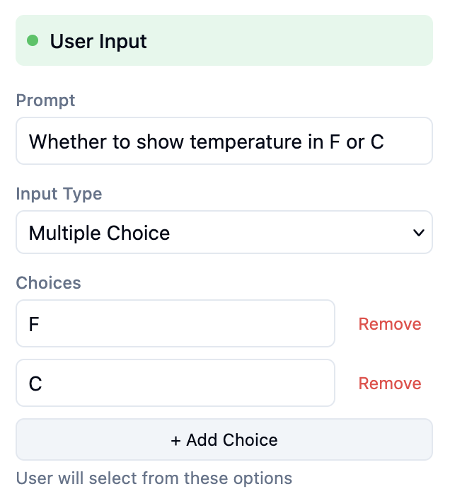
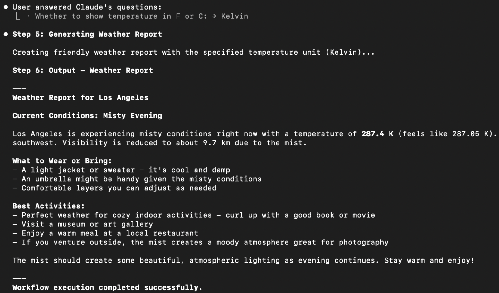
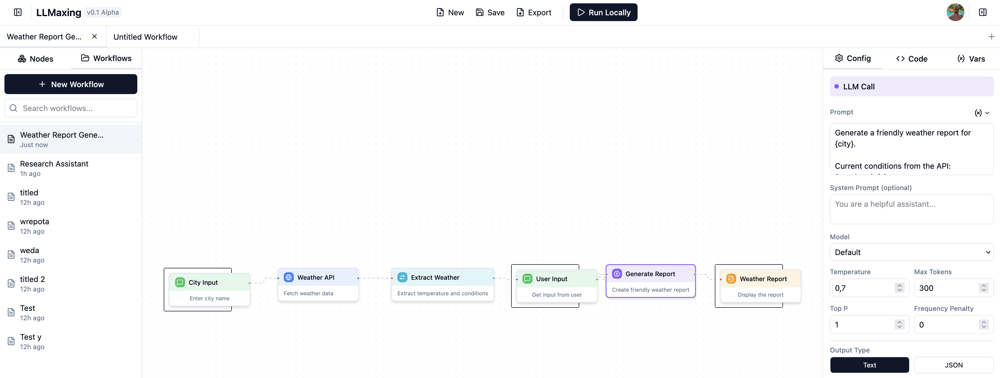
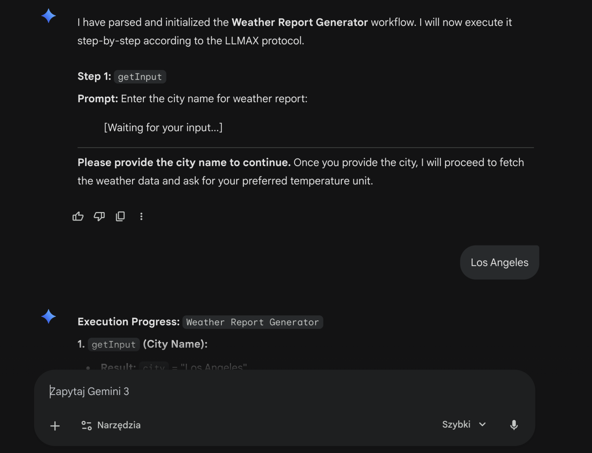

# LLMax

**What does LLMax and John Connor have in common? They both want more control over AI.**

<p align="center">
  
</p>

<p align="center">
  <b>LLM-agnostic meta-language for reliable, reproducible, no-code agentic pipelines.</b><br/>
</p>

<p align="center">
  🌐 <a href="https://sigma.llmaxing.com/">Try the Visual Workflow Builder</a>
</p>

---

## Why LLMax exists

Prompt spaghetti is fragile. Agent “frameworks” are often tied to one runtime. Copy-pasting mega-prompts is expensive and hard to debug.

**LLMax is a self-contained, text-based workflow format** (a meta language) that lets you define **step-by-step agentic pipelines** that are:

- **Reliable & reproducible** (the model executes explicit steps, not vibes)
- **Portable across LLMs** (LLM-agnostic protocol)
- **No plugins required** (the runtime instructions live inside the prompt/file)
- **Visual-first** (build workflows in a node editor, export as `.llmax`)
- **Token efficient** (minified runtime header can be referenced once, reused many times)

Think: *“CI/CD for reasoning”* — except the runner is whatever LLM you like.

---

## Pipelines smarter than users 

Here’s a workflow that asks the user whether they want temperature in **F** or **C**:



Now the fun part: a user enters **Kelvin** anyway (freaking users, man), and the workflow still routes correctly and produces the expected result — **without going off the rails**:



LLMax lets the model **use its reasoning** to handle edge cases, while your workflow provides **guardrails** for behavior and structure.

---

## Build workflows visually (fast)

The web builder is built for **super quick creation and customization** of workflows. No ceremony, no friction, just shipping.



The language is already **mature and expressive**. The web UI is **catching up** (and improving fast).

---

## How it works

LLMax files are **human-readable pipelines** that any LLM can execute: There’s no hidden state. The data flow is visible. Debugging is reading.

---

## Compatibility

LLMax is designed to run in places where the LLM can **follow structured, step-by-step instructions** and (ideally) handle tool/function calls.



**Works well with:**
- **Claude (web + Claude Code)**
- **Gemini (web)**
- **Your favorite agent runners** (e.g., Claude Code workflows)

**Not (yet) supported:**
- **ChatGPT Web**

---

## What you can build

LLMax isn’t a “toy DSL.” It can express real workflows:

- Automation pipelines (ETL, reporting, content pipelines)
- Multi-step agent systems (research → summarize → generate → validate)
- API orchestration + transformations
- Control flow (conditionals, loops, parallel branches)
- Error handling (try/catch, retries, assertions)
- Modular components (functions, imports)

In short: **every workflow you wish your agent framework could export as a single portable file.**

---

## Why it's the new meta - Syntax

LLMax is intentionally **boring in the best way**: line-by-line steps, explicit variables, and zero hidden state.
That means when something goes wrong, you don’t “prompt harder” — you just fix it.

Here’s a tiny example that:
1) asks what unit you want,
2) fetches weather,
3) converts when needed (even if the user is spicy and types “Kelvin”).

```llmax
#!llmax/1.0
@name: "Weather (with unit sanity)"
@version: "1.0.0"

@vars {
  CITY: "Los Angeles"
}

---

@pipeline main {
  getInput(
    prompt: "Temperature unit? (C/F) — you *can* type Kelvin, I guess",
    validate: text,
    options: ["C", "F"]
  ) -> unitRaw

  # Normalize input to a known unit (guardrails + reasoning)
  llmCall(
    system: "Normalize user input to a unit enum: C, F, or K. Return ONLY the unit.",
    prompt: "User unit: {unitRaw}"
  ) -> unit

  apiCall(
    url: "https://api.open-meteo.com/v1/forecast",
    query: {
      latitude: 34.0522,
      longitude: -118.2437,
      current_weather: true
    }
  ) -> weather

  assign(source: {weather}, path: "$.current_weather.temperature") -> tempC

  @switch ({unit}) {
    @case "C" {
      output(value: "🌤️ {CITY}: {tempC} °C", format: text)
    }
    @case "F" {
      assign(expr: "({tempC} * 9/5) + 32") -> tempF
      output(value: "🌤️ {CITY}: {tempF} °F", format: text)
    }
    @case "K" {
      assign(expr: "{tempC} + 273.15") -> tempK
      output(value: "🌤️ {CITY}: {tempK} K", format: text)
    }
    @default {
      output(value: "Unsupported unit: {unit}. Try C/F/K.", format: text)
    }
  }
}
```

## Repo structure

```text
llmax/
├── spec/                   # Protocol specification, examples (Apache 2.0)
├── tools/                  # Reference implementation (AGPL)
└── enterprise/             # Enterprise components (Commercial)
```

## Roadmap 

LLMax is currently **alpha**.

Planned:
- **Run everything in the web app** (end-to-end execution)
- Image generation support
- More editor features to match the protocol capabilities
- Plugins and third party integrations
- More examples, templates, and reusable modules


---

## Licensing

LLMax is **dual-licensed** to support open adoption *and* commercial sustainability.

### Apache 2.0 (Open Protocol)

The LLMax protocol specification, schemas, and SDKs are licensed under the **Apache License 2.0** and may be freely used in open-source or commercial projects.

**Covered directories:** `spec/`

### AGPL (Reference Implementation)

The reference implementation is licensed under **AGPLv3**. If you use it in a hosted, SaaS, or production environment, you must either:

- Open-source your changes under AGPL, or
- Obtain a commercial license

**Covered directory:** `tools/`

### Commercial License

A commercial license is required for:

- Production or enterprise use of the reference implementation
- Proprietary or internal deployments
- SaaS embedding without AGPL compliance
- Enterprise support, SLAs, or compliance requirements
- Access to enterprise-only components

**Covered directory:** `enterprise/`

---

## Contact

For commercial licensing inquiries: **arkmirecki@gmail.com**

---

## Contributing

Contributions are welcome!  
Feel free to open issues for:
- Protocol clarifications / spec gaps
- Examples & templates you want added
- Visual builder UX improvements / feature requests
- Bugs, edge cases, and “this should be easier” feedback

By contributing, you agree to license your contributions under the same terms as the respective component you’re contributing to.
